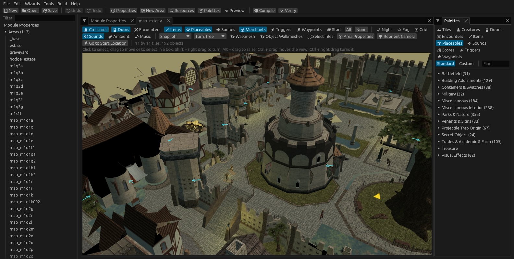
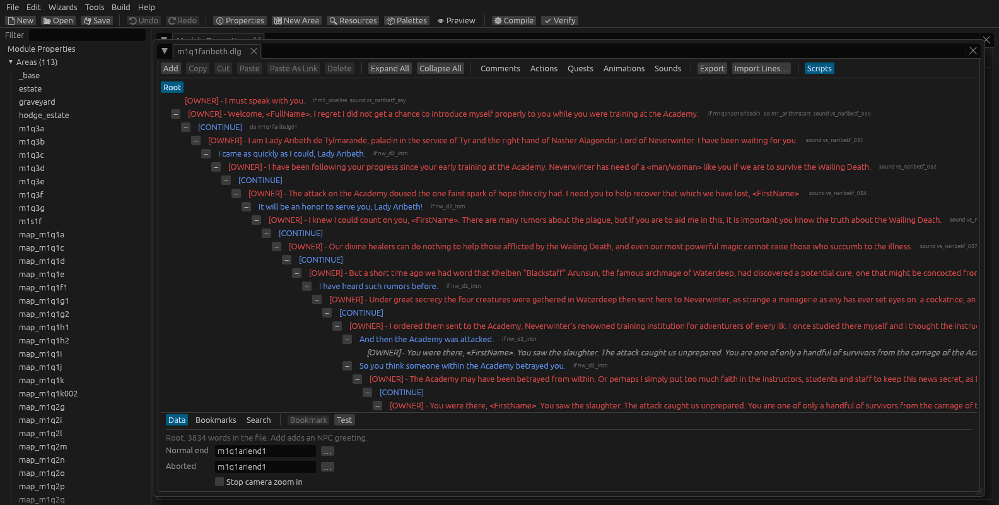
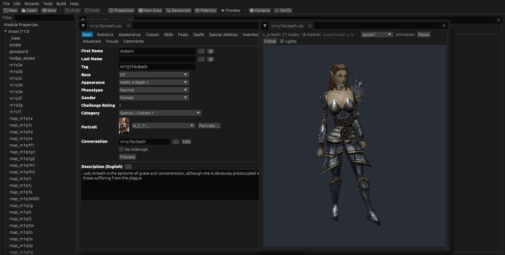
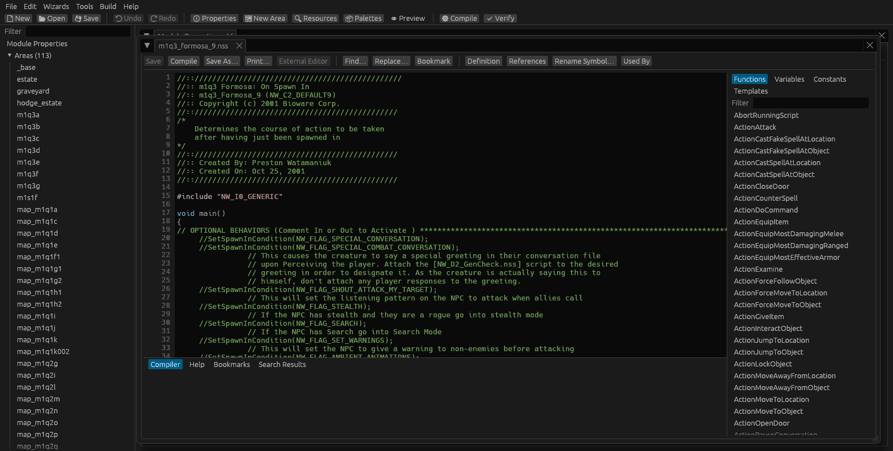

<p align="center">
  
</p>

<h1 align="center">Moonglow Toolset</h1>

<p align="center">
  A module toolset for <strong>Neverwinter Nights: Enhanced Edition</strong>, rebuilt from scratch.<br>
  Everything Aurora does, natively on Linux, Windows and macOS, and a good deal it doesn't.
</p>

<p align="center">
  <a href="https://github.com/jadzziaa/moonglow-toolset/releases/latest"></a>
  <a href="https://github.com/jadzziaa/moonglow-toolset/actions/workflows/ci.yml"></a>
  <a href="LICENSE"></a>
  
</p>

<p align="center">
  <a href="https://github.com/jadzziaa/moonglow-toolset/releases/latest"><strong>Download</strong></a> ·
  <a href="docs/manual/README.md"><strong>User manual</strong></a> ·
  <a href="docs/manual/14-coming-from-aurora.md"><strong>Coming from Aurora</strong></a>
</p>



## What it is

Moonglow is a reimplementation of BioWare's Aurora Toolset, written in Rust
with an [egui](https://github.com/emilk/egui) interface and a
[wgpu](https://wgpu.rs) renderer.
- **It edits what Aurora edits and writes what Aurora writes.** Modules it
  saves behave the same in the game. Its behavior is checked against Aurora
  itself (run off-screen under Wine), the game's server and client, and
  neverwinter.nim's tools.
- **It runs natively** on Linux, Windows and macOS: no Wine, no 32-bit memory
  limits, no `temp0` folder.
- **It never loses data.** Fields Aurora doesn't know are kept, untouched files
  are written back as they were, and unsaved work is kept in recovery copies.

Moonglow contains no game data. It reads the game's files from your
installation, so you need Neverwinter Nights: Enhanced Edition.

## Everything Aurora does

Every row of the [parity checklist](docs/parity/checklists.md) is done,
deliberately different, or partly done with the gap named:

- **Areas:** the area view, drawn with the game's lighting, fog and skyboxes
  and checked against the game's screenshots. Placing, moving, turning and
  raising objects; triggers and encounters drawn point by point; Find
  Instance and Adjust Location.
- **Terrain:** painting with a tileset's terrains, crossers and groups, raise
  and lower, tile properties, and resizing and rotating areas. The same
  strokes give the same tiles as in Aurora.
- **Blueprints:** standard and custom palettes, an editor for every blueprint
  type, and the blueprint, Creature and Levelup wizards. Item costs and
  challenge ratings come out as the game computes them.
- **Conversations, scripts, journal and factions:** the Conversation Editor
  with the Script Wizard, and a script editor with Beamdog's own NWScript
  compiler built in. Its output matches `nwn_script_comp`'s byte for byte on
  33,196 scripts.
- **Build, verify and test:** Build Module, Verify, and Test Module (F9) in
  the game.

<table>
  <tr>
    <td width="50%"></td>
    <td width="50%"></td>
  </tr>
  <tr>
    <td align="center">Conversations, with each line's scripts named</td>
    <td align="center">Blueprint editors, and models in 3D</td>
  </tr>
</table>

## And what it doesn't

Moonglow's later work follows what builders have long asked of Aurora
([the survey](docs/research/community_pain_points.md)):
- **Modules in git:** [nasher](https://github.com/squattingmonk/nasher)
  projects open and save in place, writing exactly what nasher writes.
- **Where things are used:** Find References for any script, area,
  conversation, blueprint or tag, Rename everywhere in one step, and Find and
  Replace across a module's text.
- **Scripts like code:** go to definition, references, symbol rename and
  errors as you type, also in VS Code, Neovim and other editors through
  `mg lsp`.
- **Custom content that doesn't crash:** Verify names, by file and row, what
  makes Aurora fail with an access violation; changed haks and 2DAs reload
  as you work.
- **Faster building:** snapping, Q and E to turn and G to drop to the
  ground, prefabs, editing many blueprints together, Update Instances, and
  palettes that search by tag and remember favorites.
- **Conversations out and back:** plain text, CSV (for translators), Twine
  and Ink.
- **Custom content tools:** a talk-table editor, a hak editor, a tileset
  editor that makes palettes and minimap pictures, and 2DAs shown with the
  hak each row comes from.
- **Publishing:** NWSync repositories for persistent worlds, and minimaps
  exported as the game draws them.
- **Keys you can change**, and Aurora's own as the defaults.
- **Plugins (experimental):** a team's own commands and checks, written
  in Luau and run in a sandbox; their edits are one step of Undo, and
  their checks run with Verify Module, in the window and in a build
  pipeline. The plugin API is at 0.1 and may still change.



## Download

Packages for each system are on the
[releases page](https://github.com/jadzziaa/moonglow-toolset/releases/latest):

| System | Package |
| --- | --- |
| Linux (x86-64) | `Moonglow-<version>-x86_64.AppImage`: make it executable and run it (glibc 2.35 or newer) |
| Windows 10 and 11 | `Moonglow-<version>-windows-x64-setup.exe` |
| macOS 11 and later | `Moonglow-<version>-macos.dmg` |

Moonglow finds the game where Steam installs it; otherwise choose its folder
in Tools › Options › Folders. The packages aren't signed yet: Windows'
SmartScreen and macOS' Gatekeeper ask before the first run (the release notes
say how to allow it).

### Scoop (Windows)

With [Scoop](https://scoop.sh), this repository is the bucket; `scoop update
moonglow` then follows the releases:

```powershell
scoop bucket add moonglow https://github.com/jadzziaa/moonglow-toolset
scoop install moonglow
```

### Nix

On NixOS, you can run Moonglow straight from this repository:

```sh
nix run github:jadzziaa/moonglow-toolset                 # the GUI
nix shell github:jadzziaa/moonglow-toolset -c mg --help   # the command-line tools
```

The flake builds from source, so you'll get the latest commit on `develop`
rather than the last release. With Nix on another Linux distribution, `mg`
works as it is, but the GUI typically needs a wrapper such as
[nixGL](https://github.com/nix-community/nixGL) to reach your graphics drivers.

### The command line

Every package includes `mg`, the command-line tools, for build pipelines and
scripts: pack and unpack archives, convert GFF files to JSON and back, verify
and build modules, find what a module holds, rename and replace across it,
publish to NWSync, and more. Every command can answer in JSON (`--json`).
See [Command-line tools](docs/manual/11-command-line.md).

## Documentation

- [User manual](docs/manual/README.md), also in the app under Help › User
  Manual (F1). If you know Aurora, start with
  [Coming from Aurora](docs/manual/14-coming-from-aurora.md).
- [Writing plugins](docs/manual/16-writing-plugins.md) and the
  [plugin API reference](docs/manual/17-plugin-api.md), with
  [examples](docs/plugins/README.md).
- [The plan](docs/PLAN.md): goals, architecture, phases, testing strategy and
  licensing.
- [Packaging](packaging/README.md): building the AppImage, Flatpak, Windows
  installer and macOS app.
- [Findings](docs/findings.md): what building Moonglow taught us about
  NWN:EE that wasn't documented (item values, challenge ratings, the
  game's fog and lights, Aurora's terrain painting…), each checked against
  the game, Aurora or tools, for other developers to use.
- [Research notes](docs/research/): EE file formats, rendering, tilesets,
  models, shaders, prior art, and what builders want changed in Aurora.

## Building from source

You need a stable Rust toolchain (1.98 or newer; `rust-toolchain.toml`
selects it with rustup) and a C++ compiler for the built-in script compiler:

- **Linux**: a C++ compiler, `pkg-config` and the ALSA headers
  (`libasound2-dev` on Debian and Ubuntu, `alsa-lib` on Arch and Fedora).
- **Windows**: Visual Studio's C++ build tools.
- **macOS**: the Xcode command-line tools.

```sh
cargo run --release -p moonglow          # the GUI
cargo run --release -p mg -- --help      # the command-line tools
```

## Testing

```sh
cargo test --workspace                          # unit tests (corpus tests skip without a game install)
cargo test -p mg-corpus-tests --release         # corpus, differential and engine tests
cargo clippy --workspace --all-targets          # must be warning-free
cargo fmt                                       # rustfmt.toml: width 100
```

Features land with tests at the lowest tier that catches their regressions:

- **Unit tests.**
- **Round trips** over the installed game's files.
- **Differential tests** against [neverwinter.nim](https://github.com/niv/neverwinter.nim)'s
  tools.
- **Engine runs**: a private `nwserver` and a sandboxed game client.
- **Aurora comparisons**: Aurora runs under Wine, off-screen, and its output
  is captured for comparison.

The corpus tests read the game install (`NWN_ROOT`, or Steam's usual path).
`MOONGLOW_REQUIRE_CORPUS=1` turns their skips into failures.

## Layout

A Cargo workspace, layered bottom-up:

| Folder | What |
| --- | --- |
| `crates/mg-core` | ResRef, resource types, languages, localized strings, bounds-checked binary reading, SHA-1 |
| `crates/mg-gff`, `mg-erf`, `mg-key`, `mg-2da`, `mg-tlk`, `mg-set`, `mg-ssf` | the game's file formats, lossless |
| `crates/mg-audio`, `mg-image`, `mg-mdl` | sounds, textures and models |
| `crates/mg-resman`, `mg-rules` | the game's load order, and its rules from its 2DA tables and talk tables |
| `crates/mg-schema`, `mg-module`, `mg-edit` | typed views of the authored files, the module workspace, undoable editing |
| `crates/mg-script` | the NWScript compiler and the editor's language support |
| `crates/mg-plugin` | plugins: the sandboxed Luau runtime for their commands and checks (examples and the API's types in `docs/plugins/`) |
| `crates/mg-tiles`, `mg-area`, `mg-render`, `mg-preview` | tile painting, areas, the renderer, blueprint previews |
| `crates/mg-ui` | the egui application |
| `apps/moonglow`, `apps/mg` | the GUI and the command-line tools |
| `crates/mg-testkit`, `mg-corpus-tests` | test support, and the corpus, differential and engine tests |
| `tools/` | the Aurora and game-client harnesses, shader tools |
| `packaging/` | release packages |

## License

Moonglow is free software under the [GNU General Public License, version 3](LICENSE).
It includes Beamdog's NWScript compiler (GPL-3.0), as published in
neverwinter.nim, the Ubuntu Bold font (Ubuntu Font Licence 1.0) and, for
plugins, Luau (MIT). Game
assets, including Beamdog's shaders, are only read from your installation,
never distributed. The screenshots show the game's original campaign as
Moonglow draws it.

Neverwinter Nights is a trademark of its owners. Moonglow is not affiliated
with Beamdog or Wizards of the Coast.
